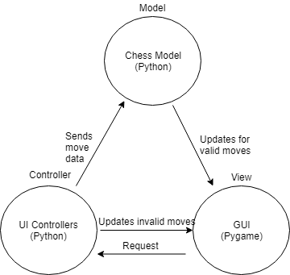

# Project Design Documentation

## Team Members:
    * Peter Carter
    * Nicholas Kelly
    * Arian Jahjaga

## Minimum Viable Product Summary
Our minimum viable product will be a Python executable that can be run from a desktop shortcut. Upon opening, users
will be taken to a start screen where they may select to play a local game against another player or against
an AI. Upon starting a game, users will be able to play legal chess as defined by the US Chess Federation's rules.

## Requirements
Our product must meet the following requirements to be defined as functional:
* Players can launch a Python executable from their desktop
* Players can select either to start a local normal game, or against an AI
* Upon starting a game, a chess board is displayed with pieces on top of it
* Pieces must be move-able via drag and drop.
* Game play follows the rules of the US Chess Federation.
* Games will conclude when checkmate is reached.

## Domain Model

> Our model is comprised of the following pieces:

* Board: This represents a chess board. It is made up of 64 squares
* Square: A single square on a chess board. It has a color attribute, and a coordinate.
* Piece: This is a super class representing all chess pieces. It has a type attribute, color, and makes moves
* Pawn, Rook, King, Queen, Knight, Bishop: These will all be subclasses of Piece, with essentially unique interpretations of a 'move' function.
* Player: represents one of the two players in a game of chess.
* Move: represents the move of a piece from one spot to another.
* Ruleset: A set of rules that dictate if a move is legal

## Summary of Project Architecture

### Model View Controller

The general structure of our project will follow a model view controller (MVC) pattern. 

Here is an illustration of MVC design within a chess game:

* Model Tier: composed of Python classes representing entities described in our domain model. Chess buisness logic lives here.
* Controller Tier: Composed of UI Controller classes written in Python. These will handle requests from the GUI. Valid requests, namely valid moves or button presses, are relayed to the model.
* View: Our view is a Pygame GUI representing a chess board. Requests will be sent by dragging and dropping chess pieces
