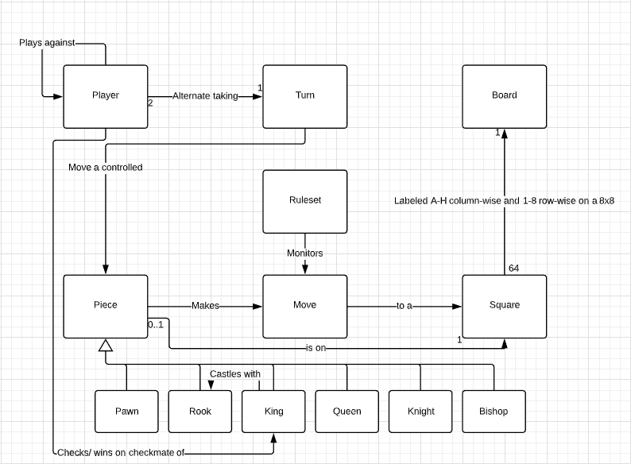

# Project Design Documentation

## Team Members:
    * Peter Carter
    * Nicholas Kelly
    * Arian Jahjaga

## Minimum Viable Product Summary

## Requirements
* Players can launch a Python executable from their desktop
* Players can select either to start a normal game, or against an AI
* Normal game play is a local game played on one computer, with two players
* AI game play is also local, but an AI makes moves for the selected color
* Game play follows the rules of the US Chess Federation

## Domain Model

> Our model is comprised of the following pieces:

* Piece: Description
* Piece2: Descreption2
* etc etc etc

## Summary of Project Architecture

Write about the project architecture (pygame)

### Model View Controller

Write about the MVC design

